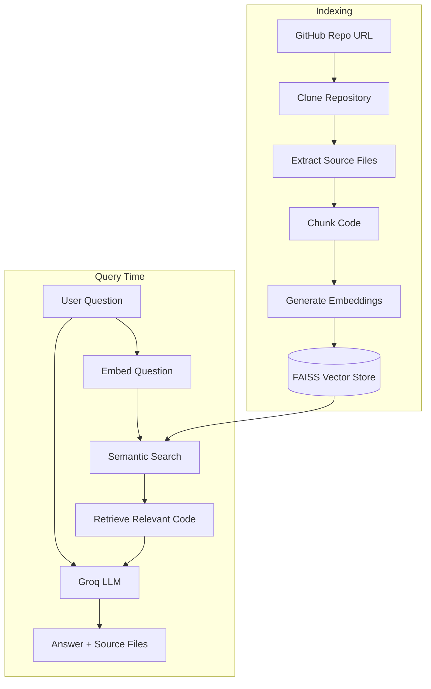

# 🗺️ CodeMap

**GPS for unfamiliar codebases.** Ask questions in plain English. Get pointed straight to the relevant code.

[](https://codemap-ai.streamlit.app/)
[](https://www.python.org/)
[](https://streamlit.io/)
[](LICENSE)

CodeMap is an AI-powered assistant that helps developers understand unfamiliar or undocumented GitHub repositories. Instead of manually digging through files and functions, point CodeMap at a repo and ask questions like *"Where is authentication handled?"* — it retrieves the relevant code and explains it, with sources cited.

**🔗 Live Demo:** https://codemap-ai.streamlit.app/
**📦 Repository:** https://github.com/19anveshh/CodeMap

---

## Table of Contents

- [The Problem](#the-problem)
- [The Solution](#the-solution)
- [How CodeMap Works](#how-codemap-works)
- [Architecture](#architecture)
- [Tech Stack](#tech-stack)
- [Supported Languages](#supported-languages)
- [Getting Started](#getting-started)
- [Usage](#usage)
- [Project Structure](#project-structure)
- [Features](#features)
- [Target Users](#target-users)
- [Challenges & Current Approach](#challenges--current-approach)
- [Roadmap](#roadmap)
- [Contributing](#contributing)
- [License](#license)

---

## The Problem

Finding the right code is often harder than writing new code.

When a developer joins an unfamiliar project, they typically have to:

- Search through hundreds or thousands of files
- Guess where a specific feature is implemented
- Read unfamiliar functions with little context
- Interrupt senior developers with repetitive questions

This makes onboarding slow and drains time from a team's most experienced (and busiest) engineers.

## The Solution

CodeMap acts as an AI guide for any codebase:

1. Paste a public GitHub repository URL
2. Click **Analyze Repository**
3. CodeMap clones, chunks, and embeds the source code
4. Ask a question in plain English
5. Get an AI-generated answer, grounded in the actual code — with source files cited

No need to know file names, function names, or project structure ahead of time.

**Example questions:**
- "Where is authentication handled?"
- "Where is the database connection?"
- "How does user registration work?"
- "Which file contains the API?"
- "Where is the main application logic?"

## How CodeMap Works

CodeMap uses **RAG (Retrieval-Augmented Generation)**: it first retrieves the code most relevant to a question, then gives that code to an LLM as context — so answers stay grounded in the real codebase instead of the model guessing from general knowledge.



## Architecture

| Layer | Responsibility |
|---|---|
| **Streamlit UI** | Repo input, question input, answer + source display |
| **Repository Handling** | Clones repo via GitPython, filters supported files |
| **Chunking** | Splits source files into smaller, embeddable units |
| **Embeddings** | `sentence-transformers/all-MiniLM-L6-v2` converts chunks to vectors |
| **Vector Store** | FAISS stores and searches embeddings |
| **Retrieval** | Finds the most relevant chunks for a given question |
| **LLM** | Groq (`openai/gpt-oss-20b`) generates the final answer from retrieved context |

## Tech Stack

| Component | Technology |
|---|---|
| Frontend | Streamlit |
| Language | Python |
| RAG Framework | LangChain |
| Embedding Model | sentence-transformers/all-MiniLM-L6-v2 |
| Vector Database | FAISS |
| LLM Provider | Groq |
| LLM Model | openai/gpt-oss-20b |
| Repository Handling | GitPython |

## Supported Languages

CodeMap currently parses:

`Python` · `JavaScript` · `JSX` · `TypeScript` · `TSX` · `Java` · `C` · `C++` · Header files

It automatically skips non-essential directories: `.git`, `node_modules`, `venv`, `.venv`, `__pycache__`, `dist`, `build`.

## Getting Started

### Prerequisites

- Python 3.10+
- Git
- A [Groq API key](https://console.groq.com/)

### Installation

```bash
# 1. Clone the project
git clone https://github.com/19anveshh/CodeMap.git
cd CodeMap

# 2. Create and activate a virtual environment
python -m venv venv

# Windows
venv\Scripts\activate
# macOS / Linux
source venv/bin/activate

# 3. Install dependencies
pip install -r requirements.txt
```

### Configuration

Create a `.env` file in the project root:

```env
GROQ_API_KEY=your_groq_api_key
```

> ⚠️ Never commit your `.env` file or API key to GitHub.

### Run

```bash
streamlit run app.py
```

Open the local URL Streamlit provides (typically `http://localhost:8501`).

## Usage

1. Open CodeMap in your browser
2. Paste a public GitHub repository URL (e.g. `https://github.com/19anveshh/youtube-rag-assistant.git`)
3. Click **Analyze Repository** and wait for indexing to finish
4. Type a question, e.g. *"Where is the main application logic?"*
5. Click **Ask CodeMap**
6. Read the AI-generated answer along with the source files it was drawn from

## Project Structure

```
CodeMap/
├── app.py                       # Main Streamlit application
├── 01_repo_loader.py            # Repository cloning
├── 02_code_reader.py            # Source file extraction
├── 03_chunker.py                # Code chunking
├── 04_embeddings.py             # Embedding generation
├── 05_vector_store.py           # FAISS vector store setup
├── 06_retriever.py              # Semantic retrieval logic
├── 07_llm.py                    # Groq LLM integration
├── 08_rag_pipeline.py           # End-to-end RAG pipeline
├── 09_repository_pipeline.py    # Repo-level orchestration
├── 10_dynamic_rag.py            # Dynamic RAG querying
├── requirements.txt
├── .gitignore
└── data/                        # Local cache / vector store data
```

> The numbered files were built incrementally to develop and test each stage of the RAG pipeline. `app.py` is the entry point for the full application.

## Features

- **Natural language search** — ask questions without knowing file or function names
- **Semantic retrieval** — finds relevant code by meaning, not just keyword matching
- **Grounded answers** — responses are generated from retrieved code, not model guesswork
- **Source transparency** — every answer cites the files it was based on
- **Simple interface** — usable by developers who are completely new to the project

## Target Users

- New developers joining an existing project
- Software development teams
- Students and open-source contributors
- Organizations maintaining large or undocumented codebases

## Challenges & Current Approach

| Challenge | Current Approach |
|---|---|
| **Large repositories** take longer to process | Focus on supported source-code file types only; skip build/dependency directories |
| **Incorrect AI answers** | Ground every answer in retrieved code before generation; cite sources |
| **External API dependency** | Modular architecture — LLM and embedding model can be swapped |

## Roadmap

- [ ] Exact line-level code references
- [ ] Function- and class-level retrieval
- [ ] Code dependency visualization
- [ ] Repository architecture visualization
- [ ] Code flow tracing
- [ ] Automatic documentation generation
- [ ] Support for more programming languages
- [ ] Better handling of very large repositories
- [ ] Conversation history / multi-turn Q&A
- [ ] Improved retrieval accuracy (hybrid search, re-ranking)

## Vision

Turn codebase exploration from a manual search process into an interactive, AI-assisted experience — so every developer can feel like they already know the codebase, from day one.

## Contributing

Contributions, issues, and feature requests are welcome. Feel free to check the [issues page](https://github.com/19anveshh/CodeMap/issues).

## License

This project is licensed under the MIT License — see the [LICENSE](LICENSE) file for details.

---

<p align="center">Ask about the code. Find the relevant information. Understand the project faster.</p>
